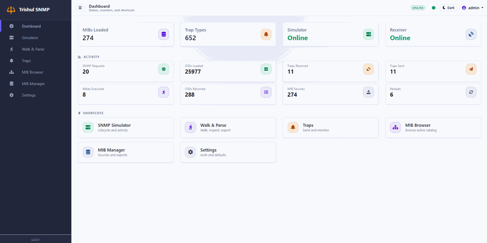

# 🔱 Trishul SNMP Suite

[](https://github.com/tosumitdhaka/trishul-snmp-suite/stargazers)
[](https://github.com/tosumitdhaka/trishul-snmp-suite/network)
[](https://github.com/tosumitdhaka/trishul-snmp-suite/issues)
[](LICENSE)
[](https://github.com/tosumitdhaka?tab=packages&repo_name=trishul-snmp-suite)

Trishul SNMP Suite is a bundle-first SNMP lab and operations shell. The current
`2.0.1` line keeps the FastAPI plus SQLite platform introduced in `2.0.0` and
adds the current hotfix cleanup around source inventory, traps, and deployment behavior while
keeping the familiar page-based operator shell as the release UI.



## 2.0.1 Highlights

- one FastAPI application in `backend/app`
- restored release UI in `frontend/` with `Dashboard`, `Simulator`, `Walk & Parse`, `Traps`, `MIB Browser`, `MIB Manager`, and `Settings`
- one unified `/api/...` surface with no secondary `/api/v2` runtime
- SQLite-backed state for settings, sessions, bundles, and notification history
- source-group-aware MIB status and export flows with a deduplicated active runtime view
- bundle, catalog, and runtime services powered by `trishul-smi` and `trishul-snmp`
- installer defaults to `8980` with optional `BACKEND_PORT` compatibility alias
- container-first logging to `stdout`/`stderr` with Docker rotation and quieter, event-focused `INFO` logs
- one current installer for the suite image plus one pinned legacy installer for `1.4.1`

## Quick Start

From a local checkout, start the published image with:

```bash
./install-trishul-snmp-suite.sh up
```

Build and run the current checkout with:

```bash
./install-trishul-snmp-suite.sh up-local
```

Default access:

- app UI: `http://localhost:8980`
- API docs: `http://localhost:8980/docs`
- default login: `admin` / `admin123`

Optional compatibility access can be added with `BACKEND_PORT=<port>` if you want the same app exposed on a second host port.

If you redeploy without `APP_PORT` or `BACKEND_PORT` overrides, the installer
reuses the current host mapping. Set `BACKEND_PORT=none` on the next restart if
you want to remove the compatibility alias.

Change the default credentials immediately in `Settings`.

### Image And Platform Overrides

The current installer accepts:

- `--platform linux/amd64|linux/arm64`
- `--image <ref>`
- `TRISHUL_IMAGE`
- `DOCKER_PLATFORM`
- `TRISHUL_DOCKER_PLATFORM`

Examples:

```bash
./install-trishul-snmp-suite.sh up --platform linux/arm64
./install-trishul-snmp-suite.sh up --image ghcr.io/tosumitdhaka/trishul-snmp-suite:latest
./install-trishul-snmp-suite.sh up-local --image trishul-snmp-suite-local:test --platform linux/amd64
```

### Legacy 1.4.1 Runtime

If you need the pinned merged runtime from the old line:

This section is intentional compatibility guidance for coexistence or rollback,
not the normal `2.0.1` runtime path.

```bash
./install-trishul-snmp-suite-v1.4.1.sh up
```

That path keeps:

- container name `trishul-snmp`
- volume name `trishul-snmp-data`
- parallel-safe defaults `8081`, `2161/udp`, and `2162/udp`

It also accepts the same `--platform` and `--image` overrides.

## UI Map

- `Dashboard`: runtime status, counters, and shortcuts
- `Simulator`: responder lifecycle, custom OID data, and activity log
- `Walk & Parse`: SNMP walk execution, parsing, filtering, and export
- `Traps`: listener control, trap send, varbind editing, and received-event history
- `MIB Browser`: module or OID tree, search, resolve, and detail inspection
- `MIB Manager`: loaded MIB status, upload, reload, dependency fetch, and trap catalog
- `Settings`: auth rotation, app settings, stats reset or export, and product metadata

## Runtime Model

The current `2.0.1` path is built around:

- `backend/app` as the live FastAPI runtime
- `frontend/` as the authored release shell copied into `frontend/dist`
- `backend/data/trishul_v2.sqlite3` as the main durable data store
- `backend/data/bundles/sets/` and `backend/data/bundles/cache/tsmi/` for bundle artifacts
- `backend/data/mibs/` and `backend/data/configs/custom_data.json` for operator-shell runtime state
- `/api/ws` for live shell events such as status, stats, traps, and simulator log updates

There is no Nginx layer in the current release path. Real-time updates come
directly from FastAPI over `/api/ws`; the old split-runtime WebSocket bridge is
gone.

## Documentation

Start with:

- [Docs Home](docs/index.md)
- [Installation Guide](docs/installation_guide.md)
- [First Steps](docs/first_steps.md)
- [Workspaces](docs/workspaces.md)
- [Architecture Overview](docs/architecture_overview.md)
- [API Reference](docs/api_reference.md)

Operator guides:

- [MIB Manager Guide](docs/mib_manager_guide.md)
- [MIB Browser Guide](docs/mib_browser_guide.md)
- [Simulator Guide](docs/snmp_simulator_guide.md)
- [Walk & Parse Guide](docs/walker_guide.md)
- [Traps Guide](docs/trap_manager_guide.md)

Development and release:

- [Development Setup](docs/development_setup.md)
- [Release Process](docs/release_process.md)
- [Roadmap](docs/roadmap.md)
- [Issue Tracker](docs/issue_tracker.md)
- [GitHub Workflow](docs/github_workflow.md)

## Development

Typical verification commands from the repo root:

```bash
npm --prefix frontend run build
.venv/bin/python -m pytest backend/ -q
.venv/bin/python scripts/check_backend_coverage.py
docker build -t trishul-snmp-suite-local:rc .
```

For Docker-backed local validation:

```bash
./install-trishul-snmp-suite.sh up-local
./install-trishul-snmp-suite.sh logs
./install-trishul-snmp-suite.sh status
```

## Roadmap

The current `2.0.1` line delivers the rewritten backend platform, SQLite
persistence, the bundle-first MIB pipeline, and the shipped operator UI with
the current hotfix cleanup around source-group inventory, realtime traps, and
deployment defaults.

The first planned `2.1.0` follow-up keeps the current operator shell and
surfaces backend-delivered features that are not yet exposed in the UI, such as
bundle lifecycle controls, saved profiles, notification replay, direct manager
operations, and system diagnostics.

Deferred beyond `2.0.x`:

- SNMPv3 runtime and UI parity
- writable `SET` responder behavior
- bundle import and export workflows
- one-click ecosystem demo flows
- distributed polling or orchestration features

See [docs/roadmap.md](docs/roadmap.md), [docs/issue_tracker.md](docs/issue_tracker.md), and [docs/changelog.md](docs/changelog.md) for the maintained release record.

## Contributing

Contributions are welcome.

Useful starting points:

- [docs/development_setup.md](docs/development_setup.md)
- [docs/github_workflow.md](docs/github_workflow.md)
- [docs/issue_tracker.md](docs/issue_tracker.md)
- [.github/CONTRIBUTING.md](.github/CONTRIBUTING.md)

## License

MIT. See [LICENSE](LICENSE).
